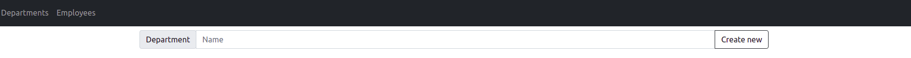

# 
 Department application 

### Vision

"Department application" is web-application which allows users to store
and manage data about departments and employees

Application should provide:
* Storing departments and employees in database
* Displaying list of departments
* Updating list of departments by executing such operations as adding, 
deleting, editing
* Displaying list of employees
* Updating list of employees by executing such operations as adding, 
deleting, editing

## 1. Departments
### 1.1 Display list of departments
#### Main scenario:
- User selects item "Departments";
- Application displays list of departments.

  
Pic. 1.1 View the departments list

The page displays the following items:
* Department mame
* Average salary
* Number of employees
Aggregate function: Average salary = Employees salaries sum / Number of employees.

### 1.2 Add Department
#### Main scenario:
* User provides department name in a field
* User clicks "Create new" button
* If any data is entered incorrectly, flash message will be displayed
* If entered data is valid, then a record will be added to the database
and flash message will be displayed
* Updated list of departments is displayed

  
Pic. 1.2 Add a department.

When adding a department, the following details are entered:
- Department name

Constraints for data validation:
- Department name - maximum length of 400 characters

### 1.3 Edit department
#### Main scenario:
* User clicks "View" button in the departments list
* Application displays page with information about selected department 
* User provides new name in a field
* User clicks "Updated" button
* If any data is entered incorrectly, flash message will be displayed
* If entered data is valid, then department will be updated in database
and flash message will be displayed
* Page with updated data is displayed

Pic. 1.3 Edit a department.

When editing a department, the following details are entered:
- Department name;

Constraints for data validation:
- Department name - maximum length of 400 characters

### 1.4 Delete department
#### Main scenario:
* User clicks "View" button in the departments list
* Application displays page with information about selected department 
* User clicks "Delete button"
* Record is deleted from database
* If error occurs, then flash message will be displayed
* If department record is successfully deleted, updated list of departments
and flash message will be displayed.

 
Pic. 1.4 Delete a department.

### 2.1 Display list of employees
#### Main scenario:
- User selects item "Employees";
- Application displays list of employees.

  
Pic. 2.1 View the employees list

The page displays the following items:
* Employee name
* Employee salary
* Employee birthdate
* Employee's department

#### Filtering by date:
* In the employees list view mode, the user sets filter criteria and clicks the "Filter" button;
* The app shows the employees who are passing criteria

Restrictions:
* Start date should be less than end date
* Providing start date is required
* If only start date is provided, then all users who born on that date will be displayed

### 2.2 Add employee
#### Main scenario:
* User clicks "Create new" button in the employees list view mode
* Application displays a page to enter employee data
* User enters employee data and clicks "Create" button
* If any data is entered incorrectly, flash message will be displayed
* If entered data is valid, then an employee is added to the database
* Page with created employee is displayed

  
Pic. 2.2 Add an employee.

When adding an employee, the following details are entered:
* Employee firs and last name
* Employee department
* Employee salary
* Employee birthdate

Constraints for data validation:
* Employee first name - maximum length of 50 characters
* Employee last name - maximum length of 50 characters
* Employee department - is chosen from combo box
* Employee salary - float value, should be greater than zero
* Employee birthdate - date

### 2.3 Edit employee
#### Main scenario:
* User clicks "View" button in the employees list view mode
* Application displays page with information about selected employee 
* User enters employee data and clicks "Edit" button
* If any error is occurred, flash message will be displayed
* If entered data is valid, then employee data will be updated in database
and flash message will be displayed
* Page with updated information id displayed

  
Pic. 2.3 Edit an employee. 

When editing a department, the following details are entered:
* Employee first and last name
* Employee department
* Employee salary
* Employee birthdate

Constraints for data validation:
* Employee first name - maximum length of 50 characters
* Employee last name - maximum length of 50 characters
* Employee department - is chosen from combo box
* Employee salary - float value, should be greater than zero
* Employee birthdate - date

### 2.4 Delete employee
#### Main scenario:
* User clicks "View" button in the employees list view mode
* Application displays page with information about selected employee 
* User enters employee data and clicks "Delete" button
* If any error is occurred, flash message will be displayed
* Page with updated list of employees and flash message are displayed.

  
Pic. 2.4 Delete an employee.